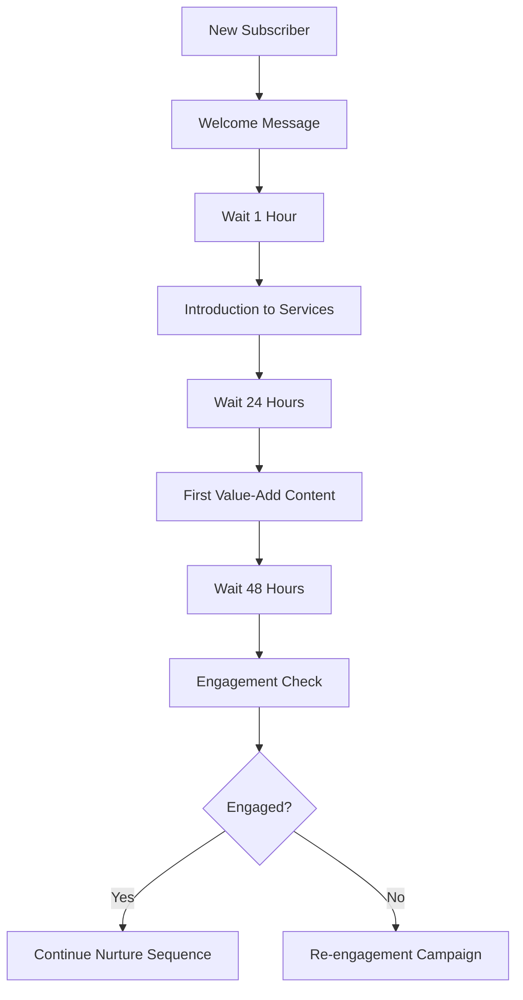

# Schedsy.ai Content & Automation Strategy Guide

## 🎯 **Strategy Development Overview**

Building a successful content and automation strategy in Schedsy.ai involves creating a systematic approach to engage your audience, nurture leads, and drive business growth through intelligent messaging and content delivery.

---

## 📋 **Strategy Foundation**

### **Step 1: Define Your Business Objectives**

#### **Primary Goals**
- **Lead Generation**: Attract and capture potential customers
- **Customer Engagement**: Keep existing customers active and interested
- **Sales Conversion**: Turn prospects into paying customers
- **Customer Support**: Provide efficient help and assistance
- **Brand Awareness**: Increase visibility and recognition

#### **Success Metrics**
- Response rates (target: >60%)
- Engagement rates (target: >30%)
- Conversion rates (target: >15%)
- Customer satisfaction scores
- Revenue attribution

### **Step 2: Audience Analysis & Segmentation**

#### **Audience Research**
```
Demographics → Behavior Patterns → Communication Preferences → Pain Points
```

#### **Segmentation Strategy**
- **New Prospects**: First-time visitors or leads
- **Engaged Leads**: Active but not yet customers
- **New Customers**: Recent purchasers
- **Loyal Customers**: Repeat buyers
- **At-Risk Customers**: Declining engagement

#### **Platform-Specific Considerations**
- **WhatsApp**: Personal, immediate, high engagement
- **Telegram**: Community-focused, broadcast-friendly
- **SMS**: Direct, urgent, high open rates

---

## 🎨 **Content Strategy Development**

### **Content Pillars Framework**

#### **Educational Content (40%)**
- **How-to guides** and tutorials
- **Industry insights** and trends
- **Best practices** and tips
- **FAQ responses**

**Example Templates:**
```
📚 Quick Tip Tuesday
"Here's a simple way to [solve common problem]..."

🎓 Industry Insight
"Did you know that [interesting statistic]? Here's what it means for you..."
```

#### **Promotional Content (30%)**
- **Product announcements**
- **Special offers** and discounts
- **Feature highlights**
- **Success stories**

**Example Templates:**
```
🎉 New Feature Alert
"We just launched [feature] to help you [benefit]..."

💰 Limited Time Offer
"Save 20% on [product] this week only..."
```

#### **Engagement Content (20%)**
- **Questions and polls**
- **Behind-the-scenes** content
- **User-generated content**
- **Interactive challenges**

**Example Templates:**
```
🤔 Quick Question
"What's your biggest challenge with [topic]? Reply and let us know!"

📸 Show & Tell
"Share a photo of [relevant topic] and we'll feature the best ones!"
```

#### **Support Content (10%)**
- **Troubleshooting guides**
- **Account assistance**
- **Technical support**
- **Escalation protocols**

**Example Templates:**
```
🔧 Need Help?
"Having trouble with [common issue]? Here's how to fix it..."

👥 Talk to a Human
"For complex issues, type 'AGENT' to connect with our support team."
```

---

## 🤖 **Automation Strategy Framework**

### **Automation Workflow Types**

#### **1. Welcome & Onboarding Sequences**

**New Subscriber Flow:**


**Template Examples:**
```
Message 1 (Immediate):
"🎉 Welcome to [Brand]! I'm excited to help you [main benefit]. 
What would you like to learn about first?"

Message 2 (1 hour):
"👋 Quick question - what's your biggest challenge with [topic]? 
This helps me send you the most relevant tips!"

Message 3 (24 hours):
"📚 Here's your first insider tip: [valuable insight]
Save this message - you'll want to reference it later!"
```

#### **2. Lead Nurturing Campaigns**

**Educational Drip Campaign:**
```
Week 1: Problem awareness
Week 2: Solution education  
Week 3: Product introduction
Week 4: Social proof
Week 5: Soft pitch
Week 6: Direct offer
```

**Template Structure:**
```
Educational Message:
"💡 [Insight/Tip]: [Valuable information]
[Brief explanation]
Want more tips like this? Reply 'YES'"

Social Proof Message:
"🌟 Success Story: [Customer name] achieved [result] using [method]
[Brief case study]
Ready to get similar results? Let's chat!"
```

#### **3. Sales Conversion Sequences**

**Product Launch Flow:**
```
Pre-launch → Announcement → Early Bird → Launch → Urgency → Last Call
```

**Conversion Templates:**
```
Announcement:
"🚀 Big news! We're launching [product] on [date]
Early birds get [special offer]. Want details?"

Urgency:
"⏰ Only 24 hours left for [offer]
[Number] people have already claimed theirs
Secure your spot: [link]"
```

#### **4. Customer Support Automation**

**Support Triage System:**
```
Keyword Detection → Category Assignment → Automated Response → Human Escalation (if needed)
```

**Support Templates:**
```
FAQ Response:
"❓ Great question! Here's the answer: [solution]
Still need help? Type 'AGENT' to talk to our team."

Escalation:
"🤝 I'm connecting you with [agent name] who specializes in [issue type]
They'll respond within [timeframe]"
```

---

## 📊 **Content Calendar Planning**

### **Weekly Content Schedule**

| Day | Content Type | Platform Focus | Automation |
|-----|--------------|----------------|------------|
| **Monday** | Educational | WhatsApp | Welcome sequences |
| **Tuesday** | Tips & Tricks | Telegram | Nurture campaigns |
| **Wednesday** | Product Focus | WhatsApp | Sales sequences |
| **Thursday** | Engagement | Telegram | Support automation |
| **Friday** | Social Proof | WhatsApp | Weekend prep |
| **Saturday** | Behind-scenes | Telegram | Light engagement |
| **Sunday** | Planning/Prep | Internal | Sequence optimization |

### **Monthly Campaign Themes**

#### **Month 1: Foundation Building**
- Week 1: Brand introduction
- Week 2: Value proposition
- Week 3: Community building
- Week 4: First conversion push

#### **Month 2: Engagement Deepening**
- Week 1: Advanced education
- Week 2: User-generated content
- Week 3: Success stories
- Week 4: Product deep-dive

#### **Month 3: Conversion Focus**
- Week 1: Problem agitation
- Week 2: Solution presentation
- Week 3: Objection handling
- Week 4: Strong call-to-action

---

## 🎯 **Personalization Strategy**

### **Dynamic Content Variables**

#### **Basic Personalization**
```
{first_name} - Personal greeting
{company} - Business context
{industry} - Relevant examples
{location} - Local references
{signup_date} - Tenure-based content
```

#### **Behavioral Personalization**
```
{last_interaction} - Recent activity
{engagement_level} - Content depth
{purchase_history} - Product recommendations
{support_tickets} - Service level
{preferences} - Content type
```

### **Segmented Messaging**

#### **By Engagement Level**
- **High Engagement**: Advanced content, exclusive offers
- **Medium Engagement**: Educational content, gentle nudges
- **Low Engagement**: Re-engagement campaigns, value reminders

#### **By Customer Journey Stage**
- **Awareness**: Educational content, problem identification
- **Consideration**: Solution comparison, social proof
- **Decision**: Offers, urgency, guarantees
- **Retention**: Upsells, loyalty programs, referrals

---

## 📈 **Performance Optimization**

### **A/B Testing Strategy**

#### **Elements to Test**
- **Message timing**: Different send times
- **Content length**: Short vs. long messages
- **Call-to-action**: Different CTA styles
- **Personalization**: Level of customization
- **Frequency**: Message cadence

#### **Testing Framework**
```
Hypothesis → Test Design → Implementation → Data Collection → Analysis → Implementation
```

### **Optimization Metrics**

#### **Engagement Metrics**
- Open rates (WhatsApp: >90%, Telegram: >70%)
- Response rates (Target: >60%)
- Click-through rates (Target: >25%)
- Conversation completion rates

#### **Conversion Metrics**
- Lead-to-customer conversion (Target: >15%)
- Revenue per message
- Customer lifetime value
- Return on automation investment

### **Continuous Improvement Process**

#### **Weekly Reviews**
- Analyze performance metrics
- Identify underperforming content
- Test new message variations
- Update automation triggers

#### **Monthly Strategy Sessions**
- Review overall campaign performance
- Adjust content calendar
- Update audience segments
- Plan new automation sequences

---

## 🛠 **Implementation Roadmap**

### **Week 1: Foundation Setup**
- [ ] Define business objectives and KPIs
- [ ] Complete audience research and segmentation
- [ ] Set up basic automation workflows
- [ ] Create initial content templates

### **Week 2: Content Creation**
- [ ] Develop content pillar framework
- [ ] Create 20+ message templates
- [ ] Set up welcome sequence
- [ ] Plan first month's content calendar

### **Week 3: Automation Implementation**
- [ ] Build lead nurturing sequences
- [ ] Set up support automation
- [ ] Create conversion workflows
- [ ] Test all automation flows

### **Week 4: Launch & Optimization**
- [ ] Launch initial campaigns
- [ ] Monitor performance metrics
- [ ] Gather feedback and insights
- [ ] Plan next month's strategy

---

## 🎯 **Advanced Strategy Techniques**

### **Multi-Channel Orchestration**
- **Cross-platform messaging**: Coordinate WhatsApp and Telegram
- **Email integration**: Supplement messaging with email
- **Social media sync**: Align messaging with social content
- **Website integration**: Connect web behavior to messaging

### **AI-Powered Optimization**
- **Predictive sending**: AI determines optimal send times
- **Content optimization**: AI suggests message improvements
- **Audience insights**: AI identifies engagement patterns
- **Automated A/B testing**: AI runs continuous optimizations

### **Advanced Segmentation**
- **Behavioral triggers**: Actions-based automation
- **Predictive modeling**: Likelihood-based targeting
- **Dynamic segments**: Real-time audience updates
- **Lifecycle automation**: Stage-based messaging

---

## 📞 **Strategy Success Checklist**

### **Content Strategy Indicators**
- ✅ Clear content pillars defined
- ✅ 30+ templates created and tested
- ✅ Content calendar planned for 3 months
- ✅ Brand voice consistently applied

### **Automation Strategy Indicators**
- ✅ Welcome sequence converting >70%
- ✅ Nurture campaigns showing engagement growth
- ✅ Support automation resolving >80% of queries
- ✅ Sales sequences generating qualified leads

### **Performance Indicators**
- ✅ Response rates >60%
- ✅ Engagement rates >30%
- ✅ Conversion rates >15%
- ✅ Customer satisfaction >4.5/5

---

## 🚀 **Next Steps**

1. **Assess Current State**: Audit existing content and automation
2. **Define Strategy**: Use this guide to create your plan
3. **Implement Gradually**: Start with basics, add complexity over time
4. **Monitor & Optimize**: Use analytics to continuously improve
5. **Scale Success**: Expand what works, eliminate what doesn't

---

*Remember: A great strategy is one that evolves. Start with the basics, measure everything, and continuously optimize based on real performance data.* 