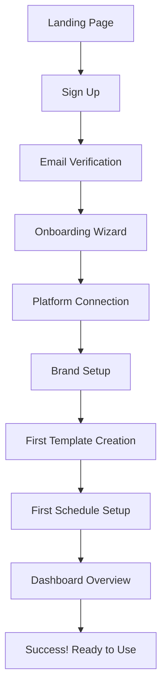
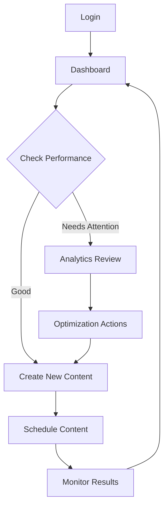
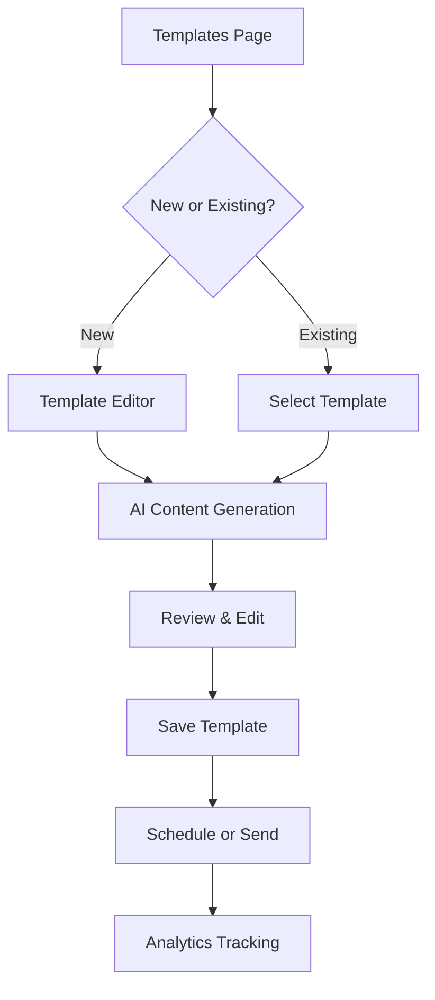

# Schedsy.ai Navigation Flow Guide

## 🧭 **Application Navigation Structure**

### **Main Navigation Layout**

```
┌─────────────────────────────────────────────────────────────┐
│                    Schedsy.ai Header                        │
│  [Logo] [Dashboard] [Templates] [Schedules] [Analytics]     │
│         [Insights] [Teams] [Settings] [Profile] [Help]     │
└─────────────────────────────────────────────────────────────┘
│
├── 📊 Dashboard (/)
│   ├── Quick Actions Panel
│   ├── Recent Activity Feed
│   ├── Performance Overview
│   └── Setup Progress Tracker
│
├── 📝 Templates (/templates)
│   ├── Template Categories
│   ├── Template Editor
│   ├── Template Analytics
│   └── Template Library
│
├── 📅 Schedules (/schedules)
│   ├── Schedule Calendar View
│   ├── Smart Schedule Builder
│   ├── Schedule Analytics
│   └── AI Optimization Panel
│
├── 📈 Analytics (/analytics)
│   ├── Real-time Dashboard
│   ├── Message Performance
│   ├── Engagement Metrics
│   └── Export Tools
│
├── 🔍 Insights (/insights)
│   ├── AI-Powered Analysis
│   ├── Performance Predictions
│   ├── Optimization Recommendations
│   └── Trend Analysis
│
├── 👥 Teams (/teams)
│   ├── Team Management
│   ├── Member Invitations
│   ├── Role Permissions
│   └── Activity Feed
│
└── ⚙️ Settings (/settings)
    ├── Platform Integration
    ├── Brand Configuration
    ├── API Management
    └── Account Settings
```

---

## 🎯 **User Flow Patterns**

### **New User Onboarding Flow**



### **Daily User Workflow**



### **Content Creation Flow**



---

## 🔄 **Feature Interconnections**

### **How Features Connect**

| Starting Point | Connects To | Action | Result |
|----------------|-------------|---------|---------|
| **Dashboard** | Templates | "Create Content" | Opens template editor |
| **Dashboard** | Schedules | "Schedule Post" | Opens schedule builder |
| **Dashboard** | Analytics | "View Performance" | Shows analytics dashboard |
| **Templates** | Schedules | "Schedule Template" | Pre-fills schedule form |
| **Templates** | Analytics | "View Performance" | Shows template-specific metrics |
| **Schedules** | Analytics | "View Results" | Shows schedule performance |
| **Analytics** | Insights | "Get Recommendations" | AI-powered optimization suggestions |
| **Insights** | Templates | "Optimize Content" | Suggests template improvements |
| **Insights** | Schedules | "Optimize Timing" | Suggests better scheduling times |
| **Teams** | All Features | "Collaborate" | Shared access to all features |

---

## 📱 **Mobile Navigation**

### **Mobile Menu Structure**

```
┌─────────────────────┐
│ ☰ Schedsy.ai    👤 │
├─────────────────────┤
│ 📊 Dashboard        │
│ 📝 Templates        │
│ 📅 Schedules        │
│ 📈 Analytics        │
│ 🔍 Insights         │
│ 👥 Teams            │
│ ⚙️ Settings         │
│ ❓ Help             │
└─────────────────────┘
```

### **Mobile Quick Actions**

- **Swipe Right**: Quick access to recent templates
- **Swipe Left**: Quick access to schedule builder
- **Pull Down**: Refresh data
- **Floating Action Button**: Create new content

---

## 🎨 **Page-Specific Navigation**

### **Dashboard Navigation**

```
Dashboard
├── Quick Actions
│   ├── Generate Content → Templates Editor
│   ├── Schedule Post → Schedule Builder
│   ├── View Analytics → Analytics Dashboard
│   └── Manage Team → Teams Page
├── Recent Activity
│   ├── Click Activity → Detailed View
│   └── Filter Options → Filtered Results
└── Performance Cards
    ├── Click Metric → Analytics Detail
    └── Optimization Hint → Insights Page
```

### **Templates Navigation**

```
Templates
├── Category Filters
│   ├── Welcome → Filtered Templates
│   ├── Support → Filtered Templates
│   ├── Sales → Filtered Templates
│   └── Marketing → Filtered Templates
├── Template Cards
│   ├── Edit → Template Editor
│   ├── Duplicate → New Template
│   ├── Schedule → Schedule Builder
│   └── Analytics → Template Performance
└── Create New
    ├── From Scratch → Template Editor
    ├── AI Generate → AI Content Generator
    └── Import → File Upload
```

### **Schedules Navigation**

```
Schedules
├── Calendar View
│   ├── Day View → Daily Schedules
│   ├── Week View → Weekly Overview
│   └── Month View → Monthly Planning
├── Schedule Cards
│   ├── Edit → Schedule Editor
│   ├── Duplicate → New Schedule
│   ├── Analytics → Performance Data
│   └── AI Optimize → Optimization Panel
└── Create New
    ├── Quick Schedule → Simple Form
    ├── Smart Schedule → AI-Powered Builder
    └── Bulk Schedule → Batch Creator
```

---

## 🔍 **Search and Discovery**

### **Global Search**

- **Location**: Top navigation bar
- **Scope**: All content, templates, schedules, analytics
- **Features**:
  - Auto-complete suggestions
  - Recent searches
  - Filter by content type
  - Quick actions from results

### **Contextual Search**

- **Templates Page**: Search by category, keywords, performance
- **Schedules Page**: Search by date, status, platform
- **Analytics Page**: Search by metric, time period, campaign
- **Teams Page**: Search by member, role, activity

---

## ⚡ **Quick Actions & Shortcuts**

### **Keyboard Shortcuts**

| Shortcut | Action | Context |
|----------|--------|---------|
| `Ctrl + N` | New Template | Templates Page |
| `Ctrl + S` | Save Current Work | Any Editor |
| `Ctrl + D` | Duplicate Item | Any List View |
| `Ctrl + /` | Open Search | Global |
| `Ctrl + K` | Command Palette | Global |
| `Esc` | Close Modal/Cancel | Any Modal |

### **Quick Action Buttons**

- **Floating Action Button**: Always visible for primary actions
- **Context Menus**: Right-click for additional options
- **Bulk Actions**: Select multiple items for batch operations
- **Quick Edit**: Inline editing for simple changes

---

## 🎯 **User Intent Mapping**

### **Common User Goals & Navigation Paths**

| User Goal | Starting Point | Navigation Path | End Result |
|-----------|----------------|-----------------|------------|
| Create content | Dashboard | Quick Actions → Generate Content | New template created |
| Schedule post | Templates | Template → Schedule Button | Post scheduled |
| Check performance | Dashboard | Performance Card → Analytics | Metrics viewed |
| Optimize timing | Schedules | Schedule → AI Optimize | Better timing set |
| Invite team member | Teams | Invite Button → Form | Member invited |
| Fix low engagement | Analytics | Low Metric → Insights | Recommendations received |
| Update brand voice | Settings | Brand Setup → Voice Config | Brand updated |
| Export data | Analytics | Export Button → Format Selection | Data downloaded |

---

## 🔄 **State Management & Context**

### **Persistent State**

- **User Preferences**: Theme, language, timezone
- **Active Filters**: Remember filter settings across sessions
- **Draft Content**: Auto-save work in progress
- **Navigation History**: Back/forward navigation support

### **Contextual State**

- **Selected Items**: Maintain selections during navigation
- **Form Data**: Preserve form inputs during interruptions
- **View Settings**: Remember list vs. grid view preferences
- **Expanded Sections**: Keep accordion states

---

## 📊 **Analytics Integration**

### **Navigation Analytics**

- **Page Views**: Track most visited pages
- **User Flows**: Identify common navigation patterns
- **Drop-off Points**: Find where users leave
- **Feature Usage**: Monitor feature adoption

### **Optimization Opportunities**

- **Streamline Popular Paths**: Make frequent actions easier
- **Reduce Friction**: Eliminate unnecessary steps
- **Improve Discovery**: Help users find underused features
- **Personalize Experience**: Adapt interface to user behavior

---

## 🎨 **Visual Navigation Cues**

### **Visual Hierarchy**

- **Primary Actions**: Prominent buttons with brand colors
- **Secondary Actions**: Subtle buttons with neutral colors
- **Destructive Actions**: Red/warning colors
- **Success States**: Green confirmation indicators

### **Navigation Feedback**

- **Active States**: Highlight current page/section
- **Loading States**: Show progress during navigation
- **Error States**: Clear error messages with recovery options
- **Success States**: Confirmation of completed actions

---

## 📱 **Responsive Navigation**

### **Breakpoint Behavior**

| Screen Size | Navigation Style | Features |
|-------------|------------------|----------|
| **Desktop** (>1200px) | Full horizontal nav | All features visible |
| **Tablet** (768-1200px) | Collapsed nav with icons | Hover for labels |
| **Mobile** (≤768px) | Hamburger menu | Slide-out drawer |

### **Touch Optimization**

- **Minimum Touch Targets**: 44px for all interactive elements
- **Gesture Support**: Swipe navigation where appropriate
- **Thumb-Friendly**: Important actions within thumb reach
- **Haptic Feedback**: Tactile confirmation on mobile

---

*This navigation guide ensures users can efficiently move through Schedsy.ai to accomplish their goals with minimal friction and maximum productivity.* 