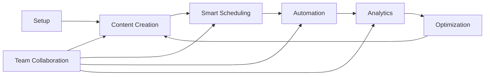

# Schedsy.ai Documentation Hub

## 📚 **Complete User Guide Collection**

Welcome to the comprehensive documentation for Schedsy.ai - your smart automation platform for messaging, content creation, and customer engagement. This documentation hub provides everything you need to master the platform.

---

## 🎯 **Start Here**

### **New to Schedsy.ai?**
1. **[Quick Reference Guide](QUICK_REFERENCE.md)** - 5-minute setup and essential shortcuts
2. **[User Journey Guide](USER_JOURNEY.md)** - Complete walkthrough from setup to mastery
3. **[Navigation Flow Guide](NAVIGATION_FLOW.md)** - How to move efficiently through the platform

---

## 📖 **Documentation Structure**

### **🚀 Getting Started**
- **[Quick Reference](QUICK_REFERENCE.md)**
  - 5-minute setup checklist
  - Essential shortcuts and quick actions
  - Troubleshooting quick fixes
  - Daily workflow checklists

### **🎯 Complete User Journey**
- **[User Journey Guide](USER_JOURNEY.md)**
  - Step-by-step onboarding process
  - Feature integration explanations
  - Best practices for success
  - Advanced features overview

### **🧭 Navigation & Flow**
- **[Navigation Flow Guide](NAVIGATION_FLOW.md)**
  - Application structure overview
  - User flow patterns and workflows
  - Mobile navigation guidelines
  - Feature interconnections

### **🎯 Strategy Development**
- **[Content & Automation Strategy Guide](CONTENT_STRATEGY_GUIDE.md)**
  - Complete strategy framework
  - Content pillars and automation workflows
  - Performance optimization techniques
  - Advanced implementation strategies
- **[Strategy Template](STRATEGY_TEMPLATE.md)**
  - Fillable template for your business
  - Step-by-step planning worksheets
  - Implementation timeline and checklists
  - Success tracking frameworks

---

## 🎨 **How to Use This Documentation**

### **For New Users**
```
1. Start with Quick Reference → Setup Checklist
2. Follow User Journey Guide → Getting Started Journey
3. Reference Navigation Flow → User Flow Patterns
4. Return to Quick Reference → Daily Checklist
```

### **For Existing Users**
```
1. Quick Reference → Feature Quick Access
2. Navigation Flow → Feature Interconnections
3. User Journey → Advanced Features
4. Quick Reference → Troubleshooting
```

### **For Team Leaders**
```
1. User Journey → Team Collaboration
2. Navigation Flow → Team Management
3. Quick Reference → Success Indicators
4. User Journey → Best Practices
```

---

## 🔄 **Feature Integration Overview**

### **Core Platform Flow**


### **Documentation Mapping**
| Feature Area | Primary Guide | Supporting Docs |
|--------------|---------------|-----------------|
| **Initial Setup** | User Journey → Getting Started | Quick Reference → Setup Checklist |
| **Content Creation** | User Journey → Content Journey | Navigation Flow → Templates Navigation |
| **Scheduling** | User Journey → Smart Scheduling | Quick Reference → Common Workflows |
| **Strategy Development** | Content Strategy Guide → Framework | Strategy Template → Implementation |
| **Team Management** | User Journey → Team Collaboration | Navigation Flow → Team Features |
| **Analytics** | User Journey → Analytics & Insights | Quick Reference → Analytics Reference |
| **Troubleshooting** | Quick Reference → Troubleshooting | Navigation Flow → Error States |

---

## 📱 **Platform-Specific Guidance**

### **Desktop Users**
- Focus on **Navigation Flow Guide** for full feature access
- Use **User Journey Guide** for comprehensive workflows
- Reference **Quick Reference** for keyboard shortcuts

### **Mobile Users**
- Start with **Navigation Flow → Mobile Navigation**
- Use **Quick Reference → Mobile Quick Actions**
- Follow **User Journey** for touch-optimized workflows

### **Team Administrators**
- Begin with **User Journey → Team Management**
- Reference **Navigation Flow → Team Features**
- Use **Quick Reference → Success Indicators**

---

## 🎯 **Success Metrics & Goals**

### **Documentation Usage Goals**
- **Week 1**: Complete setup using Quick Reference checklist
- **Week 2**: Master basic workflows via User Journey guide
- **Week 3**: Optimize navigation using Navigation Flow guide
- **Month 1**: Achieve success metrics from Quick Reference

### **Platform Mastery Indicators**
- ✅ Can navigate efficiently without documentation
- ✅ Using advanced features confidently
- ✅ Helping team members with platform questions
- ✅ Optimizing workflows based on analytics

---

## 🔧 **Documentation Maintenance**

### **Keeping Guides Current**
- **User Journey Guide**: Updated with new features and workflows
- **Navigation Flow Guide**: Reflects current UI and navigation patterns
- **Quick Reference Guide**: Includes latest shortcuts and quick fixes

### **Version Information**
- **Last Updated**: January 2025
- **Platform Version**: Schedsy.ai v1.0
- **Documentation Version**: 1.0

---

## 📞 **Getting Additional Help**

### **When Documentation Isn't Enough**
1. **Search the guides** for specific keywords
2. **Check Quick Reference** for common issues
3. **Review Navigation Flow** for feature connections
4. **Contact support** through the platform

### **Feedback & Improvements**
- **Documentation Feedback**: Help us improve these guides
- **Feature Requests**: Suggest new documentation topics
- **Error Reports**: Report outdated or incorrect information

---

## 🎉 **Quick Start Paths**

### **I want to get started immediately**
→ **[Quick Reference Guide](QUICK_REFERENCE.md)** → Setup Checklist

### **I want to understand everything thoroughly**
→ **[User Journey Guide](USER_JOURNEY.md)** → Getting Started Journey

### **I want to develop a winning strategy**
→ **[Content & Automation Strategy Guide](CONTENT_STRATEGY_GUIDE.md)** → Strategy Framework

### **I want to navigate efficiently**
→ **[Navigation Flow Guide](NAVIGATION_FLOW.md)** → User Flow Patterns

### **I need help with a specific issue**
→ **[Quick Reference Guide](QUICK_REFERENCE.md)** → Troubleshooting

### **I'm setting up a team**
→ **[User Journey Guide](USER_JOURNEY.md)** → Team Collaboration

---

## 📋 **Documentation Checklist**

### **Before You Start**
- [ ] Identify your role (new user, existing user, team leader)
- [ ] Choose the appropriate starting guide
- [ ] Bookmark this documentation hub
- [ ] Have your Schedsy.ai account ready

### **As You Learn**
- [ ] Follow the guides step-by-step
- [ ] Test features as you read about them
- [ ] Reference Quick Reference for daily use
- [ ] Share guides with team members

### **After Mastery**
- [ ] Use guides as reference material
- [ ] Help onboard new team members
- [ ] Provide feedback for improvements
- [ ] Stay updated with new documentation

---

## 🌟 **Success Stories**

### **Typical User Progression**
1. **Day 1**: Setup complete using Quick Reference
2. **Week 1**: Basic workflows mastered via User Journey
3. **Week 2**: Efficient navigation using Navigation Flow
4. **Month 1**: Advanced features and team collaboration
5. **Month 3**: Platform expert helping others

### **Team Implementation**
1. **Admin**: Masters all guides, sets up team structure
2. **Managers**: Focus on User Journey and team features
3. **Members**: Use Quick Reference and basic workflows
4. **Everyone**: Benefits from improved collaboration and efficiency

---

*This documentation hub is your complete resource for mastering Schedsy.ai. Start with the guide that matches your current needs and experience level.*

---

**📚 Quick Links:**
- [Quick Reference Guide](QUICK_REFERENCE.md) - Fast setup and daily use
- [User Journey Guide](USER_JOURNEY.md) - Complete learning path
- [Navigation Flow Guide](NAVIGATION_FLOW.md) - Efficient platform navigation 