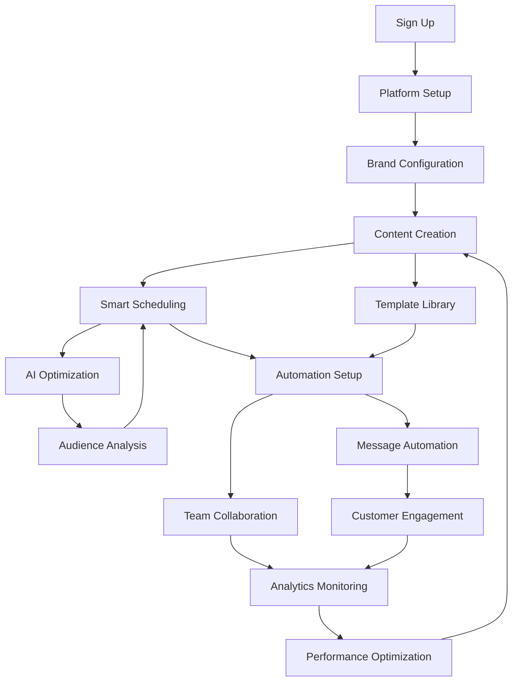

# Schedsy.ai User Journey Guide

## 🎯 **Overview**
Schedsy.ai is a comprehensive smart automation platform that transforms how businesses manage their messaging, content creation, and customer engagement. This guide walks you through the complete user journey from setup to advanced automation.

---

## 🚀 **Getting Started Journey**

### **Step 1: Initial Setup (5 minutes)**
**Goal**: Get your account ready and connected

1. **Account Creation**
   - Sign up with email/password or social login
   - Verify email address
   - Access the dashboard

2. **Platform Connection**
   - Navigate to **Settings** → **Platform Integration**
   - Connect your messaging platform (Telegram/WhatsApp)
   - Test connection with a simple message

3. **Brand Setup**
   - Go to **Brand Setup** page
   - Define your brand voice and tone
   - Set industry and target audience
   - Configure AI personality settings

**✅ Success Indicator**: You can send and receive messages through the platform

---

## 🎨 **Content Creation Journey**

### **Step 2: AI Content Generation (10 minutes)**
**Goal**: Create engaging content with AI assistance

1. **Access Content Tools**
   - Navigate to **Dashboard** → **Quick Actions**
   - Click "Generate Content" or use the AI content generator

2. **Content Creation Process**
   ```
   Input Brief → AI Processing → Content Generation → Review & Edit → Save/Use
   ```

3. **Content Types Available**
   - Social media posts (Instagram, Facebook, Twitter, LinkedIn)
   - WhatsApp/Telegram messages
   - Email campaigns
   - Blog posts and articles

4. **AI Enhancement Features**
   - **Brand Voice Consistency**: AI maintains your brand tone
   - **Engagement Scoring**: Get predictions on content performance
   - **Multi-Platform Optimization**: Content adapted for each platform

**✅ Success Indicator**: You've generated and saved your first AI-powered content

---

## 📅 **Smart Scheduling Journey**

### **Step 3: Schedule Optimization (15 minutes)**
**Goal**: Automate your content delivery with AI-powered timing

1. **Access Scheduling**
   - Go to **Schedules** page
   - Click "Create New Schedule"

2. **Smart Schedule Builder**
   ```
   Content Selection → Audience Analysis → AI Time Optimization → Schedule Creation
   ```

3. **AI-Powered Features**
   - **Audience Behavior Analysis**: AI analyzes when your audience is most active
   - **Optimal Timing Suggestions**: Get recommendations with confidence scores
   - **Performance Predictions**: See expected engagement rates
   - **Alternative Time Options**: Multiple timing suggestions

4. **Schedule Types**
   - One-time posts
   - Recurring campaigns
   - Event-triggered messages
   - Drip campaigns

**✅ Success Indicator**: Your first smart schedule is active and optimized

---

## 🤖 **Automation Workflows**

### **Step 4: Message Automation (20 minutes)**
**Goal**: Set up intelligent automated responses and workflows

1. **Template Library**
   - Navigate to **Templates** page
   - Browse pre-built templates by category:
     - Welcome messages
     - Support responses
     - Sales follow-ups
     - Marketing campaigns

2. **Automation Flows**
   ```
   Trigger Definition → Response Logic → AI Enhancement → Testing → Activation
   ```

3. **Trigger Types**
   - **Keyword-based**: Respond to specific words/phrases
   - **Time-based**: Send messages at scheduled times
   - **Behavior-based**: React to user actions
   - **Event-driven**: Respond to external events

4. **AI-Enhanced Responses**
   - Context-aware replies
   - Personalized content
   - Sentiment analysis
   - Escalation to human agents

**✅ Success Indicator**: Automated responses are working and engaging customers

---

## 👥 **Team Collaboration**

### **Step 5: Team Management (10 minutes)**
**Goal**: Collaborate effectively with your team

1. **Team Setup**
   - Go to **Teams** page
   - Create your team
   - Invite team members with appropriate roles

2. **Role-Based Access**
   - **Owner**: Full access to all features
   - **Admin**: Manage team and most features
   - **Manager**: Content and campaign management
   - **Member**: Content creation and basic features
   - **Viewer**: Read-only access

3. **Collaboration Features**
   - Shared content libraries
   - Team activity feeds
   - Permission-based access control
   - Real-time collaboration

**✅ Success Indicator**: Team members can access and collaborate on projects

---

## 📊 **Analytics & Insights**

### **Step 6: Performance Monitoring (Ongoing)**
**Goal**: Track performance and optimize strategies

1. **Analytics Dashboard**
   - Navigate to **Analytics** page
   - View real-time metrics and trends

2. **Key Metrics Tracked**
   - Message delivery rates
   - Response times
   - Engagement rates
   - AI performance scores
   - Automation effectiveness

3. **Performance Insights**
   - Go to **Insights** page for AI-powered analysis
   - Get recommendations for improvement
   - View predictive analytics
   - Export detailed reports

4. **Optimization Loop**
   ```
   Monitor Performance → Analyze Insights → Adjust Strategy → Implement Changes → Repeat
   ```

**✅ Success Indicator**: You're making data-driven decisions to improve performance

---

## 🔄 **Complete User Flow Integration**

### **How Everything Connects**



---

## 🎯 **Feature Integration Map**

### **Core Feature Relationships**

| Feature | Connects To | How It Helps |
|---------|-------------|--------------|
| **Brand Setup** | Content Generation, Templates | Ensures consistent voice across all content |
| **AI Content Generator** | Scheduling, Templates, Automation | Creates engaging content for all channels |
| **Smart Scheduling** | Analytics, Performance Insights | Optimizes timing based on audience behavior |
| **Template Library** | Automation, Team Collaboration | Provides reusable content for workflows |
| **Message Automation** | Analytics, Customer Engagement | Handles responses and nurtures leads |
| **Team Collaboration** | All Features | Enables team-wide access and coordination |
| **Analytics Dashboard** | Performance Insights, Optimization | Tracks success and identifies improvements |
| **Performance Insights** | Smart Scheduling, Content Strategy | Provides AI-powered recommendations |

---

## 🛠 **Navigation Guide**

### **Primary Navigation Structure**

```
📊 Dashboard (Home)
├── 📈 Quick Actions
├── 📋 Recent Activity
└── 🎯 Performance Overview

🎨 Content & Automation
├── 📝 Templates
├── 📅 Schedules
├── 🤖 AI Agents
└── 👥 Clients

📊 Analytics & Insights
├── 📈 Analytics
├── 🔍 Insights
└── 📋 Reports

⚙️ Settings & Team
├── 👥 Teams
├── 🎨 Brand Setup
├── 🔧 Settings
└── 🚀 Onboarding
```

### **Quick Access Patterns**

1. **Daily Workflow**: Dashboard → Analytics → Templates → Schedules
2. **Content Creation**: Templates → AI Generator → Schedules → Analytics
3. **Team Management**: Teams → Settings → Brand Setup
4. **Performance Review**: Analytics → Insights → Optimization

---

## 💡 **Best Practices for Success**

### **Week 1: Foundation**
- ✅ Complete platform setup and brand configuration
- ✅ Create your first 5 templates
- ✅ Set up basic automation flows
- ✅ Schedule your first week of content

### **Week 2: Optimization**
- ✅ Analyze performance data
- ✅ Optimize scheduling based on insights
- ✅ Expand automation workflows
- ✅ Invite team members

### **Week 3: Scaling**
- ✅ Create advanced automation sequences
- ✅ Implement AI-powered optimizations
- ✅ Set up comprehensive analytics tracking
- ✅ Develop content calendar

### **Week 4: Mastery**
- ✅ Fine-tune all automations
- ✅ Optimize based on performance insights
- ✅ Scale successful campaigns
- ✅ Train team on advanced features

---

## 🎯 **Success Metrics**

### **Key Performance Indicators**

| Metric | Target | How to Track |
|--------|--------|--------------|
| **Setup Completion** | 100% in first week | Onboarding progress |
| **Message Response Rate** | >60% | Analytics dashboard |
| **Automation Efficiency** | >80% automated responses | Performance insights |
| **Team Adoption** | All members active | Team activity feed |
| **Content Engagement** | >30% engagement rate | Analytics reports |

---

## 🚨 **Troubleshooting Common Issues**

### **Setup Issues**
- **Platform Connection Failed**: Check API credentials in Settings
- **Brand Voice Inconsistent**: Review Brand Setup configuration
- **Messages Not Sending**: Verify platform integration status

### **Performance Issues**
- **Low Engagement**: Use Performance Insights for optimization recommendations
- **Automation Not Triggering**: Check trigger conditions in Templates
- **Team Access Problems**: Review permissions in Teams management

### **Getting Help**
1. **In-App Guidance**: Look for 💡 help icons throughout the interface
2. **Documentation**: Access help articles from Settings
3. **Support**: Contact support through the help center
4. **Community**: Join user community for tips and best practices

---

## 🎉 **Advanced Features**

### **Power User Capabilities**
- **Custom AI Agents**: Create specialized AI assistants for different tasks
- **Advanced Analytics**: Deep-dive into performance metrics and trends
- **API Integration**: Connect with external tools and services
- **White-label Options**: Customize the platform for your brand

### **Enterprise Features**
- **Multi-brand Management**: Handle multiple brands from one account
- **Advanced Team Permissions**: Granular access control
- **Custom Integrations**: Tailored connections to your existing tools
- **Dedicated Support**: Priority assistance and training

---

## 📞 **Next Steps**

1. **Start Your Journey**: Begin with the onboarding flow
2. **Explore Features**: Try each feature to understand capabilities
3. **Build Your Strategy**: Develop a content and automation strategy
4. **Monitor & Optimize**: Use analytics to continuously improve
5. **Scale Success**: Expand successful campaigns and workflows

**Remember**: Schedsy.ai grows with your business. Start simple, learn the platform, and gradually implement more advanced features as your needs evolve.

---

*Last Updated: January 2025*  
*For the latest features and updates, check the in-app changelog and announcements.* 